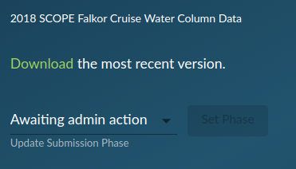

User Submitted Dataset Walkthrough
==================================

This example should walk you through the steps of ingesting a user submitted dataset into the database.

For this example, we are going to be using the dataset: **Falkor_2018 - 2018 SCOPE Falkor Cruise Water Column Data**

Removal of Previously Existing Dataset 
--------------------------------------

This dataset was an early submitted dataset and has recently been revised to being it up to line with the current CMAP data submission guidelines.
Because this dataset already exists in the database, we must first remove the old version.

To do this, we can use some of the functionality in cmapdata/ingest/metadata.py

By calling this function **deleteCatalogTables(tableName, server)**, we can remove any metadata and data tables from a given server. 

.. warning::
    This function has drop privileges! Make sure you want to wipe the dataset metadata and table.

.. code-block:: console

   python metadata.py 

.. code-block:: python

   >>> deleteCatalogTables('tblFalkor_2018','Rainier')

Continue this function for any other existing servers. ex. 'Mariana','Rossby'

Transferring the Dataset to Staging
-----------------------------------

Currently there is a disconnect from where the web validator places datasets and where the ingestion pipeline starts. 
The temporary workaround is to download the completed and QA'ed dataset with the **download dataset** button. 
Transfer the dataset to the shared dropbox vault of '/CMAP Data Submission Dropbox/Simons CMAP/staging/combined/'
From here, the data ingestion pipeline can begin.

Specifying the Ingestion Arguments 
----------------------------------

Using ingest/general.py, you can pass command line arguments to specify which server you wish to add the dataset to as well as including a DOI.
This dataset does not have a user submitted DOI link, so it is excluded in the example. 

Navigate to the ingest/ submodule of cmapdata. From there, run the following in the terminal. 

.. code-block:: python

   python general.py {table_name} {branch} {filename} {-d} {DOI link} {-S} {server}

* {**branch**}: Branch where dataset should be placed in Vault. Ex's: cruise, float, station, satellite, model, assimilation]
* {**filename**}: Base file name in vault/staging/combined/. Ex.: 'global_diazotroph_nifH.xlsx'
* {**-d**}: Optional flag for including DOI with dataset in tblReferences. DOI link string follows flag arg. 
* {**DOI link**}: String for full web address of CMAP specific DOI. Ex. "http://doi.org/10.5281/zenodo.4968554"
* {**-S**}: Required flag for specifying server choice. Server name string follows flag. 
* {**server**}: Valid server name string.  Ex. "Rainier", "Mariana" or "Rossby"

An example string would be:

.. code-block:: python

   python general.py tblFalkor_2018 cruise 'Falkor_2018.xlsx'  -S "Rainier"

Behind the scenes, the script is doing:

 1. parsing the user supplied arguments. 
 2. Splitting the data template into data, dataset_metadata and vars_metadata files. 
 3. Transfering the files to **vault/**.
 4. Importing into memory the data, dataset_metadata and vars_metadata sheets as pandas dataframes. 
 5. Creating a suggested SQL table and index based on the infered data.
 6. Insert data into newly created table. 
 7. Insert metadata into various metadata tables, match cruises and classify ocean region(s). 
 8. Create summary stats and insert into tblDataset_Stats
 9. Create dataset icon and push to github. 

Once the first server ingestion completes without any errors, check the catalog to see if the table is visable.
It is also advisable to try to plot one or more variables. 
When you are satisfied with the ingestion, continue adding to any remaining servers.

.. Note::
   See the future code changes section for ideas on improvements.

   

