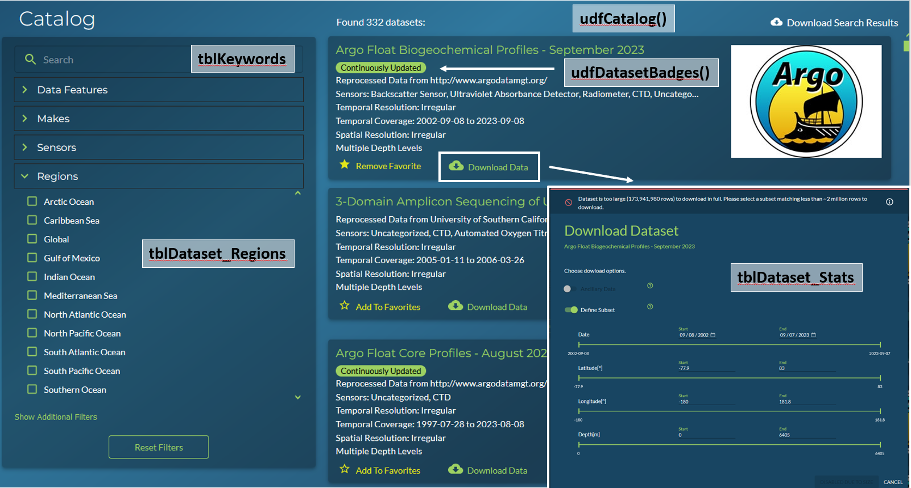
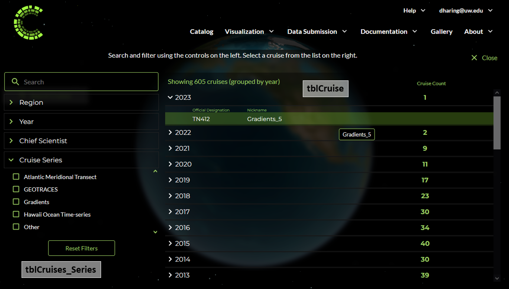
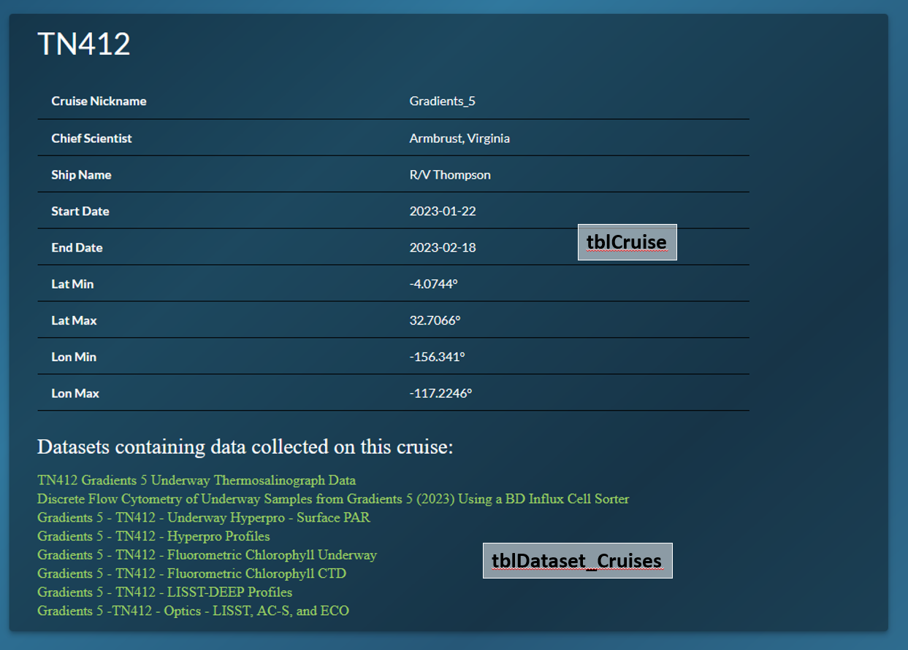
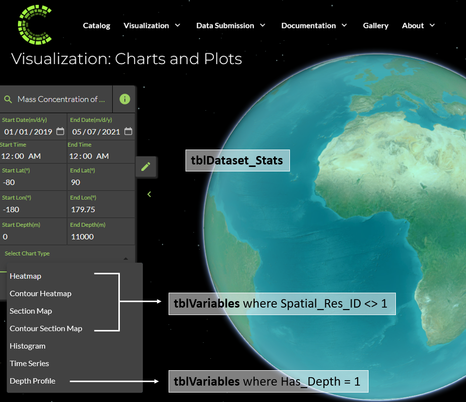

CMAP Website
=============

Below are a handful of screenshots of the CMAP website with names of the core tables in the database that populate each section. The examples given are based on lessons learned when debugging various issues after updates to the database.

The functionality on the catalog page relies on multiple core tables. 

* The search box relies on keywords associated with a dataset.
* The dataset cards are populated by the udfCatalog() SQL function
* The regions filter pulls from tblDataset_Regions. While all datasets that have gone through the QCI API checks include regions as keywords, the region filter does not reference keywords.
* The download data dialog populates the subset values from tblDataset_Stats.

The top of the dataset page uses a stored procedure to join data from three core SQL tables: 

.. figure:: ../_static/dataset_page_1.png
   :scale: 70 %

The bottom of the dataset page uses udfVariableCatalog() which is optimized to extract the JSON data from tblDataset_Stats more efficiently. 
The entries diplayed in the references section show all references submitted in the validator template, along with an additional DOI where applicable. 
The linked cruises at the bottom will display if there is a match on Name or Nickname in tblCruise. If the cruise is not yet in CMAP, the cruise name included in the dataset_meta_data tab of the validator excel template will not be displayed here. All datasets run through the QC API will include all cruise names and nicknames listed in the template as keywords. 

.. figure:: ../_static/dataset_page_2.png
   :scale: 70 %

The cruise page groups cruises by year. If a cruise is added to tblCruise but does not include a min/max time value, the cruise name will be grouped in a NULL category at the bottom of listed years. 

Only cruises that are associated with a dataset are displayed in the cruise search list. The cruise page will link you back to each dataset page it is associated with. 

If a cruise is added but does not have an associated trajectory, selecting the cruise will zoom you in on your current view of the globe. The location the globe zooms you to is based on the data in tblCruise_Trajectory, not based on the min/max of lat/lon in tblCruise.

.. figure:: ../_static/cruise_viz.png
   :scale: 80 %

The viz page will show different charting options depending on the variable selected. Only gridded datasets (typically model or satellite) should be given a defined spatial resolution. If a variable is assigned a spatial resolution other than "Irregular" (ID = 1), it cannot have any missing lat/lon values that would leave holes in the global coverage. 
The depth profile chart option will only be visible if the Has_Depth = 1 in tblVariables.

