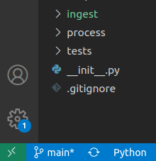

Compute Resources and Data Storage
==================================

The two main computers used in the ingestion pipeline are a Dell XPS 15 laptop and a newer Exxact workstation. 
For memory intensive and multi-core data processing, the workstation is a useful resource. 
It could either be used directly from the lab or ssh'ed into to run processing jobs. 
Using VS Code's **Remote-SSH** extension, you can connect and modify files over ssh without using command line editors. 
To start a connection, click on the bottom left green icon.
The ip address is for the workstation is 128.208.238.117

Data Flow 
---------

The web validator stores submitted datasets to Dropbox (**Dropbox/Apps/<dataset_short_name>/<dataset_short_name_timestamp.xlsx>**). After submission the CMAP data team runs the dataset through the QC API. The outputs from the QC API are saved in Dropbox (**Dropbox/Apps/<dataset_short_name>/iterations/1/propose**). When changes are approved by the submitter, a copy of the finalized dataset is added to the accept folder within the iteration folder structure, as well as to the final folder where ingestion will pull from (**Dropbox/Apps/<dataset_short_name>/final**). Only one file should be saved in the final folder for ingestion.

Ingesting a dataset submitted through the validator pulls from the final folder and creates a folder based on the table name in the **vault/** directory based on the data type ().

Data Storage
------------

Both the web application and the data ingestion pipeline share storage over dropbox. With an unlimited account, 
we can use dropbox to store all our pre-DB data. In addition to dropbox, the **vault/** also is synced on the workstation under:
**~/data/CMAP Data Submission Dropbox/Simons CMAP/vault/**

.. note::
    Ideally this path should be changed to remove any spaces. The hold-up is unlimited account is grandfathered in at its current naming convention. 

Dropbox's CLI tools are installed on the workstation. Using the selective sync feature of dropbox, the **/vault** stored on disk can be synced with the cloud.
By reading/writing to disk, IO speeds for data processing should be improved.

If dropbox has stopped syncing, you can start the CLI by typing in terminal:

.. code-block:: console

   dropbox start
   dropbox status 

Workstation Repositories
------------
Scripts for new SQL tables and indicies are written to the DB repository found here: **~/Documents/CMAP/DB/**

Python scripts for collection, ingestion, and processing are written to the cmapdata repository found here: **~/Documents/CMAP/cmapdata/**. The dataingest branch contains the most recent updates. 

Synology NAS and Drobo Storage
------------------------------

Before storing data on Dropbox, two non-cloud storage methods were tried. Both the Drobo and Synology NAS are desktop size hard disk storage. Each contains ~40-50TB of disk space. 
There are limitations to each of these. The Drobo requires a connection through usb-c/thunderbolt. The Synology NAS can be accessed over the internet, ie ((Network Attached Storage).
They read/write speed for both is quite slow compared to the disks on the workstation. Perhaps one or both could be used as another backup?

