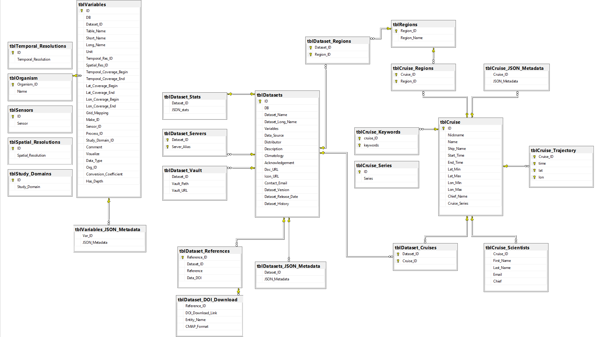

Database Design and Table Structure
===================================

   CMAP DB metadata specific table database diagram

Simons CMAP currently has three servers that contain near replicates of the SQL Server database. The names of these three are: Rainier, Mariana and Rossby. 
Rainier was the first dedicated server to host the database and currently serves as the main 'source of truth'. 

In addition to the three SQL Servers there is a a Spark SQL Warehouse cluster with Apache Hive ANSI SQL:2003 interface. Its alias is: Cluster. This is used for large datasets (i.e. satellite data and Darwin) or large, continuously updated datasets (i.e. Argo data).

.. warning::
   Rainier is currently the production database and 'source of truth'. If you want to test features, use Mariana or Rossby. 

Data tables along with metadata tables are stored in the same schema. Common queries live on the database as stored procedures. 
Data tables are independent of one another. The dataset table name is stored as a column in the metadata table *tblVariables*. 
This key links the data tables to the rest of the metadata.

Metadata tables are listed below with a brief description of each:

Variable Level Metadata
-----------------------

**tblVariables** links the data tables to the metadata through the column [Table_Name]. 
Columns with an _ID suffix are linked to other metadata tables. For example, Dataset level information in tblDatasets in linked through [Dataset_ID].
Each data variable in a dataset has a row in this table, containing the following columns:

* ID
* DB
* Dataset_ID
* Table_Name
* Short_Name
* Long_Name
* Unit
* Temporal_Res_ID
* Spatial_Res_ID
* Temporal_Coverage_Begin
* Temporal_Coverage_End
* Lat_Coverage_Begin
* Lat_Coverage_End
* Lon_Coverage_Begin
* Lon_Coverage_End
* Grid_Mapping
* Make_ID
* Sensor_ID
* Process_ID
* Study_Domain_ID
* Comment
* Visualize
* Data_Type
* Org_ID
* Conversion_Coefficient
* Has_Depth

**tblOrganism** contains the organism name and the Organism_ID connects to Org_ID in tblVariables for a variable describing organism abundance. Additional tables related to the organism identification project are: **tblOrgTaxon**, **tblOrgTrophic_Level**, **tblOrgSubtrophics**, **tblOrgTrophics**, **tblOrgSize_Image_Bigelow**, **tblOrgFunctional_Group_WORMS**, **tblOrgParaphyletic_Group_WORMS**, **tblOrgUnicellularity_WORMS**. Details on the project can be found in Jira Epic 8 (https://simonscmap.atlassian.net/browse/CMAP-8)

**tblKeywords** contains user submitted keywords used in the searching of a variable. 
tblKeywords contains an ID column, where each value which corresponds to a unique variable entry in tblVariables. 

* var_ID
* keywords

**tblTemporal_Resolution**, **tblSpatial_Resolution**, **tblMake**, **tblSensor**, **tblProcess_Stages**, and **tblStudy_Domains** are all variable level tables that contain links between the ID's in tblVariables and their respective tables. 

**tblVariables_JSON_Metadata** contains additional variable metadata that is unstructured to allow users to include any information that does not fall within the information in tblVariables.

For details on the unstructured metadata project see Jira the following tickets: (https://simonscmap.atlassian.net/browse/CMAP-563, https://simonscmap.atlassian.net/browse/CMAP-572). Each unstructured metadata object includes a value array and a description array. Values and descriptions are always arrays, even if empty or single values. Also, these arrays must always have identical lengths, even if descriptions are empty strings. Descriptions are meant to be human readable, short descriptions akin to alt-text for an image online. A single variable may have multiple entries in tblVariables_JSON_Metadata. An example of a variable-level unstructured metadata is:

.. code-block:: SQL

   {"cruise_names":{"values":["PS71"],"descriptions":["Operators Cruise Name"]},"meta_links":{"values":["https://www.bodc.ac.uk/data/documents/nodb/285421/"],"descriptions":["BODC documentation link"]}}

.. note::
    As of September 2023 the only dataset with unstructured metadata is Geotraces Seawater IDP2021v2. Argo Core and Argo BGC are both good candidates for including unstructured metadata. 
 

Dataset Level Metadata
----------------------

**tblDatasets** contains dataset level information and has links to tblVariables as well as links to cruise and region level information.

* ID
* DB
* Dataset_Name
* Dataset_Long_Name
* Variables
* Data_Source
* Distributor
* Description
* Climatology
* Acknowledgement
* Doc_URL
* Icon_URL
* Contact_Email
* Dataset_Version
* Dataset_Release_Date
* Dataset_History

**tblDataset_References** holds references associated with the dataset, typically a DOI, paper citation, or website. References that are true DOIs with data frozen in time are linked by Reference_ID to **tblDataset_DOI_Download**. This table is used for automating the download of DOI data (DOI_Download_Link) and includes a flag for whether the DOI download is the CMAP template used for submission via the validator (CMAP_Format)

**tblDataset_Vault** contains the relative path to the dataset leaf directory as well as a public link to the dataset leaf directory (read-only permission). In the future this may be joined to the catalog.

**tblDataset_Servers** holds the alias names of each server the dataset can be found on. This was implemented to allow for replication across some but not all servers, and free up space on Rainier.

**Cruise Metadata**
The metadata for cruises in CMAP is separated into multiple tables. A core **tblCruise** links 
together metadata tables for cruise trajectories, cruise keywords, cruise region links and cruise dataset links.
**tblDataset_Cruises** is the linking table to connect cruise_IDs with dataset_IDs.  

**Region Metadata**
The region tables in CMAP share a similar schema to the cruise tables layout. **tblRegions** contains the ocean regions 
(this can be expanded). 
**tblDataset_Regions** is similar to **tblDataset_Cruises** because it acts as the linking table between the region and dataset tables. 
**tblCruise_Regions** is a linking table between cruise IDs and region IDs. 

**tblDatasets_JSON_Metadata** contains additional dataset metadata that is unstructured to allow users to include any information that does not fall within the information in tblDatasets.

For details on the unstructured metadata project see Jira the following tickets: (https://simonscmap.atlassian.net/browse/CMAP-563, https://simonscmap.atlassian.net/browse/CMAP-572). As with the variable-level unstructured metadata, ach unstructured metadata object for datasets includes a value array and a description array. Values and descriptions are always arrays, even if empty or single values. Also, these arrays must always have identical lengths, even if descriptions are empty strings. Descriptions are meant to be human readable, short descriptions akin to alt-text for an image online. A dataset may have multiple entries in tblDatasets_JSON_Metadata. An example of a dataset-level unstructured metadata is:

.. code-block:: SQL

   {"publication_link":{"values":["https://www.geotraces.org/geotraces-publications-database/"],"descriptions":["Link to database of GEOTRACES publications"]}}

.. note::
    As of September 2023 the only dataset with unstructured metadata is Geotraces Seawater IDP2021v2. Argo Core and Argo BGC are both good candidates for including unstructured metadata. 